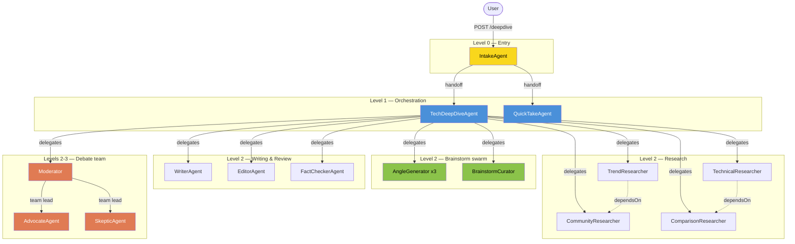
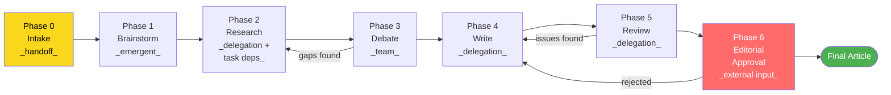

# Autonomous Agent Samples

Samples demonstrating the `AutonomousAgent` component — an LLM-driven component with built-in durable execution and multi-agent coordination. Unlike request-based `Agent` (which handles single request-response interactions), an Autonomous Agent runs as a process: iterating through an LLM decision loop until its assigned tasks are complete.

Each sample focuses on a specific capability or coordination pattern. They progress from minimal usage to sophisticated multi-agent systems.

## Overview

| Sample | Capabilities | Description |
| --- | --- | --- |
| **helloworld** | None | Simplest usage — single agent, single task, no coordination |
| **pipeline** | None (task dependencies) | 3-phase dependency chain: collect, analyze, report |
| **docreview** | None (attachments) | Document review with text content attachments |
| **research** | Delegation | Coordinator delegates to researcher and analyst, synthesises findings |
| **consulting** | Delegation + handoff | Delegate to specialists, hand off complex cases |
| **support** | Handoff | Triage classifies request, hands off to billing or technical specialist |
| **publishing** | Delegation + external input | Delegate writing and editing, request editorial approval |
| **compliance** | Handoff + external input | Triage risk level, hand off high-risk, human approval |
| **debate** | Team | Moderator with debaters, collaborative argumentation |
| **devteam** | Team | Team lead decomposes project into tasks, developers self-coordinate |
| **brainstorm** | Team (emergent) | Team generates ideas on shared board, lead curates |
| **editorial** | Team + external input | Team lead with writers, human approval of final publication |
| **deepdive** | All capabilities | Comprehensive demo: handoff, delegation, teams, emergent, task deps, external input, nested orchestration |

---

## helloworld

The simplest autonomous agent sample. A single agent answers a question and returns a typed result.

**Agents:** QuestionAnswerer

**Tasks:** ANSWER → `Answer(answer, confidence)`

**Flow:** A user submits a question via HTTP. The endpoint creates a QuestionAnswerer instance and runs a single ANSWER task with the question as instructions. The agent processes the question and produces a structured answer with a confidence score. The user polls a separate endpoint to retrieve the result.

**Demonstrates:** Basic autonomous agent lifecycle — task creation, agent execution, typed result retrieval. No coordination, no tools, no multi-agent interaction. The minimum viable autonomous agent.

**Try it:**

```bash
# Submit a question
curl -X POST http://localhost:9000/questions \
  -H "Content-Type: application/json" \
  -d '{"question": "What is 2 + 2?"}'
# Returns: {"taskId":"<task-id>"}

# Poll for the result
curl http://localhost:9000/questions/<task-id>
# Returns: {"answer":"...","confidence":95,"status":"COMPLETED"}
```

---

## pipeline

A single agent processes three tasks in a dependency chain: collect data, analyze it, then write a report. Task dependencies enforce execution order.

**Agents:** ReportAgent

**Tasks:**
- COLLECT → `ReportResult(phase, content)` — gather data on a topic
- ANALYZE → `ReportResult(phase, content)` — analyze collected data (depends on COLLECT)
- REPORT → `ReportResult(phase, content)` — write final report (depends on ANALYZE)

**Flow:** The endpoint creates all three tasks up front with explicit dependency relationships, then assigns them to a single ReportAgent instance. The agent processes them in dependency order — it cannot start ANALYZE until COLLECT completes, and cannot start REPORT until ANALYZE completes. The agent has domain tools (`collectData`, `analyzeData`) for the first two phases.

**Demonstrates:** Task dependencies as an ordering mechanism. Multiple tasks assigned to a single agent instance. Pre-created tasks (as opposed to `runSingleTask`). Sequential pipeline without multi-agent coordination — the ordering comes from task dependencies, not from handoff between agents.

---

## docreview

A single agent reviews a document for compliance, receiving the document content as a task attachment rather than inline in the instructions.

**Agents:** DocumentReviewer

**Tasks:** REVIEW → `ReviewResult(assessment, findings, compliant)`

**Flow:** A user submits a document and review instructions via HTTP. The endpoint creates a REVIEW task with the review instructions as task instructions and the document text attached as `TextMessageContent`. The agent reviews the attached document against the instructions and produces a structured compliance assessment with specific findings and an overall compliance verdict.

**Demonstrates:** Task attachments for passing large content to agents without embedding it in instruction text. Structured result types with multiple fields. Single-agent, single-task pattern with richer input than helloworld.

---

## research

A coordinator agent delegates research to two specialist agents, then synthesises their findings into a unified brief. The first multi-agent sample, demonstrating the delegation (fan-out/fan-in) pattern.

**Agents:**
- ResearchCoordinator — receives the research topic, delegates to specialists, synthesises results
- Researcher — gathers facts and sources on a topic
- Analyst — identifies trends, implications, and actionable insights

**Tasks:**
- BRIEF → `ResearchBrief(title, summary, keyFindings)` — the top-level research output
- FINDINGS → `ResearchFindings(topic, facts, sources)` — factual research from Researcher
- ANALYSIS → `AnalysisReport(topic, assessment, trends)` — trend analysis from Analyst

**Flow:** A user submits a research topic. The endpoint creates a BRIEF task and assigns it to a ResearchCoordinator. The coordinator decides to delegate: it creates a FINDINGS task for the Researcher and an ANALYSIS task for the Analyst. Both specialists work in isolated contexts — they see only their own task. When both complete, their results flow back to the coordinator, which synthesises the facts and trends into a unified ResearchBrief.

**Demonstrates:** Delegation capability (`canDelegateTo`). Context partitioning — each specialist sees only its slice of the problem. Fan-out to parallel workers and fan-in for synthesis. The coordinator maintains full context and is responsible for coherence. Delegated agents shut down after their task completes.

---

## consulting

A coordinator that can both delegate routine research to a subordinate and hand off complex problems to a senior specialist. Demonstrates combining delegation and handoff in a single agent.

**Agents:**
- ConsultingCoordinator — assesses client problems, routes to appropriate expertise level
- ConsultingResearcher — performs targeted research on specific aspects (delegation target)
- SeniorConsultant — handles complex, high-stakes issues (handoff target)

**Tasks:**
- ENGAGEMENT → `ConsultingResult(assessment, recommendation, escalated)` — the client problem
- RESEARCH → `ResearchSummary(topic, findings)` — sub-task for routine investigation

**Flow:** A client submits a consulting problem. The coordinator assesses complexity using shared tools (`assessProblem`, `checkComplexity`). For standard problems, the coordinator delegates a RESEARCH task to the ConsultingResearcher, waits for findings, and synthesises a recommendation (escalated=false). For complex problems (regulatory, M&A), the coordinator hands off the entire ENGAGEMENT task to the SeniorConsultant, who takes full ownership and completes it (escalated=true).

**Demonstrates:** Composing delegation and handoff in a single agent. The key distinction: delegation creates a child task and retains ownership of the parent — the coordinator synthesises results. Handoff transfers ownership of the current task to another agent — the coordinator steps back entirely. Shared tools across agents for consistent assessment. Routing logic driven by the LLM using domain tools.

**Try it:**

```bash
# Submit a standard problem (delegation flow)
curl -X POST http://localhost:9000/engagements \
  -H "Content-Type: application/json" \
  -d '{"problem": "How to improve supply chain efficiency"}'
# Returns: {"taskId":"<task-id>"}

# Submit a complex problem (handoff flow)
curl -X POST http://localhost:9000/engagements \
  -H "Content-Type: application/json" \
  -d '{"problem": "Regulatory compliance for our upcoming merger"}'

# Poll for result
curl http://localhost:9000/engagements/<task-id>
# Returns: {"status":"COMPLETED","result":{"assessment":"...","recommendation":"...","escalated":false}}
```

---

## support

A triage agent classifies customer support requests and hands off to the appropriate specialist. The pure handoff pattern — no delegation, just routing.

**Agents:**
- TriageAgent — classifies requests and routes to the right specialist
- BillingSpecialist — resolves billing disputes, payment issues, invoice queries
- TechnicalSpecialist — diagnoses and resolves technical problems, bugs, outages

**Tasks:** RESOLVE → `SupportResolution(category, resolution, resolved)`

**Flow:** A customer submits a support request. The TriageAgent receives a RESOLVE task, analyzes the request to determine its category (billing or technical), and hands off to the appropriate specialist. The specialist takes ownership of the same RESOLVE task, resolves the issue, and completes it with a typed resolution.

**Demonstrates:** Handoff capability (`canHandoffTo`). Sequential/relay pattern where control transfers between agents. All agents share the same task type — the task moves between agents rather than new tasks being created. The triage agent is lightweight (3 iterations) while specialists have more room to work (5 iterations). Clear role separation: classifier vs. resolver.

---

## publishing

*Not yet implemented.*

A coordinator delegates writing and editing to specialist agents, then requests editorial approval before publishing. Combines delegation with external (human) input.

**Agents:** Publishing coordinator, writer, editor

**Demonstrates:** Delegation with external input. Human-in-the-loop approval gating the final output. Task guard rules that evaluate results and determine whether external approval is required.

---

## compliance

*Not yet implemented.*

A triage agent assesses risk level and routes accordingly — low-risk requests are resolved directly, high-risk requests are handed off to a specialist that requires human approval before completing.

**Agents:** Compliance triage, compliance specialist

**Demonstrates:** Handoff with external input. Risk-based routing where the approval requirement depends on the classification. Combining automated triage with human oversight for high-stakes decisions.

---

## debate

*Not yet implemented.*

A moderator agent leads a structured debate between debater agents. Debaters argue positions, challenge each other, and refine arguments through multiple rounds of exchange.

**Agents:** Moderator (team lead), debater agents (team members)

**Demonstrates:** Team capability with collaborative argumentation. Peer-to-peer messaging where agents directly influence each other's reasoning. The moderator structures the debate, manages turns, and synthesises conclusions. Context is exchanged — agents build on and challenge each other's contributions.

---

## devteam

*Not yet implemented.*

A team lead decomposes a software project into tasks. Developer agents claim tasks from a shared list, work on them independently, and message peers when coordination is needed. The lead monitors progress and disbands the team when done.

**Agents:** Team lead, developer agents (team members)

**Demonstrates:** Team capability with self-coordination. Shared task list where members autonomously claim and complete work. Peer messaging for coordination when tasks have dependencies. The team lead's role is decomposition and oversight, not micromanagement.

---

## brainstorm

*Not yet implemented.*

A team generates ideas on a shared board. Each agent contributes independently, building on or diverging from existing ideas. A lead curates the results — the final output emerges from accumulation and selection rather than explicit coordination.

**Agents:** Brainstorm lead, idea generators (team members)

**Demonstrates:** Team capability with emergent behavior. Indirect coordination through a shared environment (the idea board) rather than direct messaging. Agents influence each other through what they leave behind, not through conversation. The lead provides curation and selection, turning quantity into quality.

---

## editorial

*Not yet implemented.*

A team lead coordinates writers who collaborate on a publication. Writers work on assigned sections, review each other's work, and refine through peer feedback. The final publication requires human editorial approval before completion.

**Agents:** Editorial lead (team lead), writer agents (team members)

**Demonstrates:** Team capability with external input. Collaborative writing with peer review. Human-in-the-loop approval for the final publication. Combines the team coordination pattern with external gating — the team produces the work, but a human makes the final call.

---

## deepdive

A comprehensive demo application that exercises all coordination capabilities in a single coherent system. A user submits a technology topic and the system produces a thoroughly researched, debated, and reviewed deep-dive article — with every orchestration decision driven by LLMs, not code.

15 agent types across 4 levels of nesting cover delegation, handoff, collaborative teams, emergent coordination, task dependencies, external input, and LLM-driven looping.

### Agent hierarchy



### Pipeline flow



**Agents:**

Agents are organized by nesting depth in the orchestration hierarchy. Level 0 is the entry point that receives user requests. Level 1 agents own the main task. Level 2 agents are delegated to by level 1. Level 3 agents operate inside a level 2 sub-team. The levels are structural (who contains whom), not temporal — level 2 agents appear in multiple phases of the pipeline.

*Entry (level 0):*
- IntakeAgent — classifies incoming requests and hands off to the appropriate orchestrator

*Orchestration (level 1):*
- TechDeepDiveAgent — top-level orchestrator for full deep-dive articles; delegates to all sub-teams and manages the overall pipeline
- QuickTakeAgent — lightweight agent for simple opinion requests (handoff target from IntakeAgent)

*Brainstorm swarm (level 2):*
- AngleGenerator — runs as 3 independent instances with different prompt biases (contrarian, practical, historical); writes ideas to a shared board without coordinating with other generators
- BrainstormCurator — reads the shared board, merges overlapping ideas, selects the 3-4 strongest angles as the research agenda

*Research (level 2):*
- TrendResearcher — gathers trend data, adoption curves, industry momentum (web search/fetch tools; no task dependencies)
- TechnicalResearcher — investigates architecture, performance, ecosystem maturity (web search/fetch tools; no task dependencies)
- CommunityResearcher — finds community sentiment, forum discussions, migration stories (web search/fetch tools; depends on TrendResearcher — needs trend context to search for relevant reactions)
- ComparisonResearcher — compares subject technology against alternatives (web search/fetch tools; depends on TechnicalResearcher — needs technical details for meaningful comparison)

*Debate team (levels 2-3):*
- Moderator — team lead for the debate; creates the team, adds members, creates debate tasks in a shared task list, structures rounds via messages, synthesises conclusions, disbands the team
- AdvocateAgent — team member; claims debate tasks, reads the Skeptic's arguments via peer messages, argues in favor of the technology
- SkepticAgent — team member; claims debate tasks, reads the Advocate's arguments via peer messages, challenges claims and highlights weaknesses

*Writing and review (level 2):*
- WriterAgent — drafts and revises the article; receives research, debate synthesis, and reviewer feedback as context
- EditorAgent — reviews structure, flow, clarity, and style; returns actionable editorial notes
- FactCheckerAgent — verifies claims against research findings; flags unsupported claims with severity levels

**Tasks:**
- ARTICLE → `Article(title, content, summary)` — the top-level output; created by IntakeAgent, completed by TechDeepDiveAgent
- QUICK_TAKE → `QuickTake(title, opinion, confidence)` — for simple requests routed to QuickTakeAgent
- BRAINSTORM → `BrainstormResult(angles: List<Angle>)` — curated angle set from the brainstorm phase
- ANGLE → `Angle(title, description, priority)` — individual angle contributed by an AngleGenerator
- RESEARCH → `ResearchFindings(topic, facts, sources)` — findings from each researcher
- DEBATE_SYNTHESIS → `DebateSynthesis(consensus, disputes, gaps)` — Moderator's summary of the debate
- DEBATE_POSITION → `DebatePosition(position, arguments, evidence)` — each debater's contribution
- DRAFT → `ArticleDraft(title, content, wordCount)` — article draft from WriterAgent
- EDIT_REVIEW → `EditReview(assessment, suggestions, approved)` — editorial feedback
- FACT_CHECK → `FactCheckResult(claims: List<ClaimVerification>, allVerified)` — fact-check results

**Flow:**

Phases describe the temporal sequence of the pipeline. Phase 0 happens before TechDeepDiveAgent is involved. Phases 1-6 are driven by the orchestrator's LLM in typical order, though the LLM controls actual sequencing and may loop between phases.

*Phase 0 — Intake (handoff).* A user submits a topic via `POST /deepdive`. The IntakeAgent receives an ARTICLE task, classifies the request, and hands off to the appropriate orchestrator. A deep technical topic goes to TechDeepDiveAgent (full pipeline). A simpler request ("quick take on the new React compiler") goes to QuickTakeAgent (lightweight, no sub-teams). The IntakeAgent transfers ownership — it's done after handoff.

*Phase 1 — Brainstorm (emergent/swarm).* The TechDeepDiveAgent delegates to the brainstorm swarm. Three AngleGenerator instances run independently, each with a different prompt bias: one contrarian ("what if conventional wisdom is wrong?"), one practical ("what would a practitioner care about?"), one historical ("what precedents or parallels exist?"). Each writes ideas to a shared board via domain tools. They don't coordinate directly — they influence each other only through what's on the board (stigmergy). The BrainstormCurator then reads the board, merges overlapping ideas, and selects the strongest angles as the research agenda. Different topics produce different angle selections.

*Phase 2 — Research (delegation + task dependencies).* The TechDeepDiveAgent delegates to four researchers. TrendResearcher and TechnicalResearcher have no dependencies and start immediately in parallel. CommunityResearcher depends on TrendResearcher (needs trend context to search for relevant community reactions). ComparisonResearcher depends on TechnicalResearcher (needs technical details for meaningful comparisons). The framework enforces this ordering via `dependsOn()`. All researchers use web search and web fetch tools to find real data — blog posts, benchmarks, documentation, forum discussions.

*Phase 3 — Debate (collaborative team).* The TechDeepDiveAgent delegates to the Moderator, who creates a team with AdvocateAgent and SkepticAgent as members. The Moderator creates debate tasks in a shared task list ("Opening arguments", "Rebuttals", "Final positions") and structures rounds via messages. The Advocate and Skeptic claim tasks, read each other's arguments via peer messages, and respond directly. The Skeptic might challenge a performance claim; the Advocate adjusts their position. This is the team pattern — not delegation, where workers are isolated. Members influence each other's reasoning through direct exchange. The Moderator synthesises conclusions and disbands the team.

*Research ↔ Debate loop.* The TechDeepDiveAgent reads the debate synthesis. If the Skeptic raised points the research didn't adequately cover, the orchestrator's LLM decides to loop back to the ResearchTeam with targeted questions. The goal mentions "max 2 research cycles" but the decision to loop is the LLM's.

*Phase 4 — Write (delegation).* The TechDeepDiveAgent delegates to the WriterAgent with all accumulated context: selected angles, research findings, debate synthesis. The writer produces an ArticleDraft.

*Phase 5 — Review (delegation).* The TechDeepDiveAgent delegates to the EditorAgent and FactCheckerAgent. The editor reviews structure, flow, and clarity. The fact-checker verifies claims against the research findings.

*Write ↔ Review loop.* If reviewers flag issues, the orchestrator's LLM sends the article back to the WriterAgent with the feedback, then through review again. The goal mentions "max 2 revision rounds" but the decision is the LLM's.

*Phase 6 — Editorial approval (external input).* After reviews pass, a task guard rule determines the article requires human sign-off. The task transitions to `WAITING_FOR_INPUT`. The system surfaces the article to a human reviewer. The human can approve (→ final article published) or reject with feedback ("the intro is too technical") → the orchestrator loops back to the WriterAgent with the human's note, then through review again.

**Coordination capabilities exercised:**

| Capability | Implementation |
|---|---|
| Handoff | IntakeAgent → TechDeepDiveAgent or QuickTakeAgent; ownership transfers, intake agent is done |
| Delegation | TechDeepDiveAgent → all sub-teams; ResearchTeam → researchers; ReviewTeam → reviewers |
| Team (collaborative) | DebateTeam: Moderator (lead) + Advocate + Skeptic with shared task list and peer messaging |
| Emergent (swarm) | BrainstormSwarm: 3 independent generators + curator; shared board, no direct coordination |
| Task dependencies | CommunityResearcher dependsOn TrendResearcher; ComparisonResearcher dependsOn TechnicalResearcher |
| External input | Editorial approval gate before final publication; human can approve or reject with feedback |
| LLM-driven looping | Research↔Debate loop, Write↔Review loop, approval rejection loop — all LLM decisions |
| Nested orchestration | TechDeepDive delegates to Moderator, who internally runs a team; 4 levels of nesting |

**HTTP API:**

- `POST /deepdive` — submit a topic; returns task ID for the top-level ARTICLE task
- `GET /deepdive/{taskId}` — check status, current phase, intermediate results
- `POST /deepdive/{taskId}/approve` — approve the article for publication
- `POST /deepdive/{taskId}/reject` — reject with feedback, triggering a revision loop

**Demonstrates:** All AutonomousAgent coordination capabilities in a single application. LLM-driven orchestration with no workflow steps or if-statements controlling the flow. Nested orchestration where sub-teams use different coordination patterns internally. Natural looping driven by LLM judgment. Human-in-the-loop gating for the final output. Real tool use (web search/fetch) at the leaf agents. The full spectrum from simple handoff routing to complex multi-level delegation with emergent brainstorming and collaborative debate.
