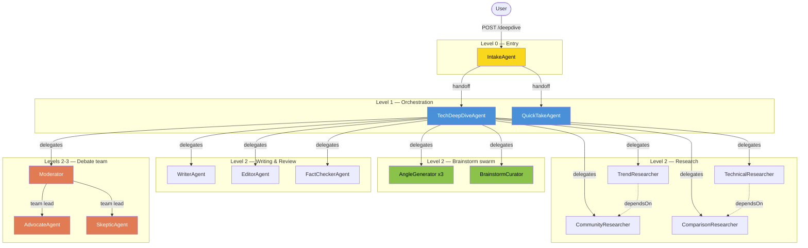
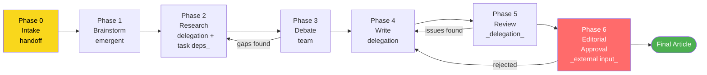
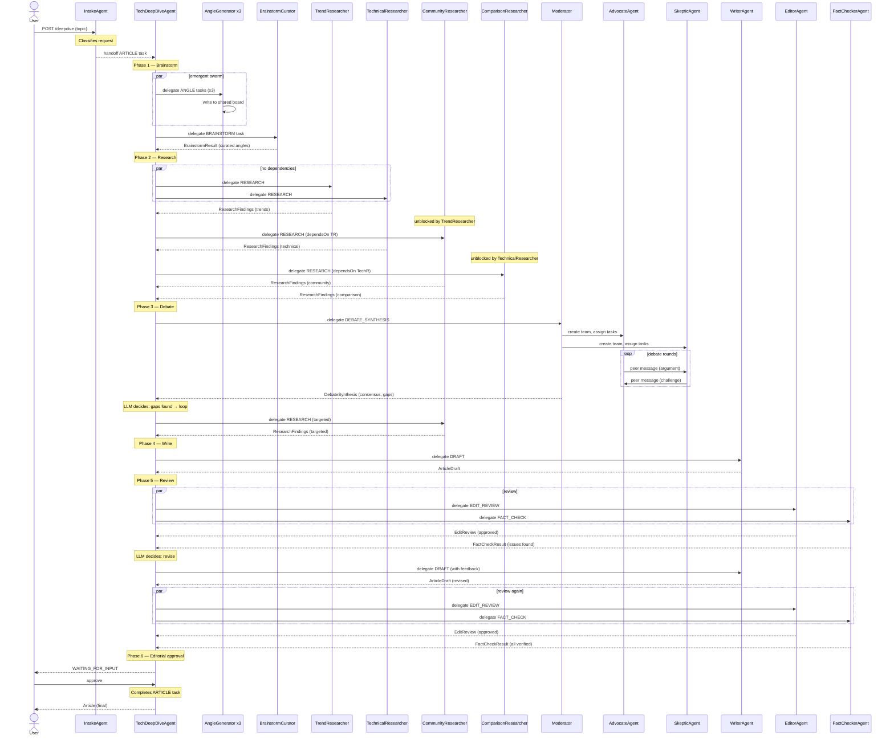

# TechDeepDive — Autonomous Agent Demo Application

> **Note:** This document is the design rationale and proposal for the deepdive demo. The formal specification with requirements, acceptance scenarios, and success criteria is in [`spec.md`](spec.md).

A comprehensive demo application showcasing all coordination capabilities of the AutonomousAgent component. A user submits a technology topic and the system produces a thoroughly researched, debated, and reviewed deep-dive article — with every orchestration decision driven by LLMs, not code.

The demo exercises delegation, handoff, collaborative teams, emergent coordination, task dependencies, external input, LLM-driven looping, and nested orchestration in a single coherent application.

---

## Agent Hierarchy



## Pipeline Flow



## Runtime Sequence (happy path)



---

## Capability Coverage

| Capability | Where in demo | Pattern |
|---|---|---|
| **Single agent, single task** | Each leaf agent | Baseline |
| **Task dependencies** | ResearchTeam: Community depends on Trend, Comparison depends on Technical | Pipeline ordering via `dependsOn()` |
| **Delegation** | TechDeepDive → all sub-teams; ResearchTeam → researchers; ReviewTeam → reviewers | Fan-out/fan-in with context partitioning |
| **Handoff** | IntakeAgent → TechDeepDiveAgent or QuickTakeAgent | Triage/routing, ownership transfer |
| **Team (collaborative)** | DebateTeam: Moderator + Advocate + Skeptic with shared task list and peer messaging | Peer-to-peer exchange, mutual influence |
| **Emergent (swarm)** | BrainstormSwarm: independent generators writing to shared board, curator selects | Stigmergy, indirect coordination |
| **External input** | Editorial approval gate before final publication | Human-in-the-loop gating |
| **LLM-driven looping** | Research↔Debate, Write↔Review, and approval rejection loops | No code-driven control flow |
| **Nested orchestration** | TechDeepDive contains ResearchTeam, DebateTeam, ReviewTeam — each an orchestrator | Multi-level hierarchy |

---

## Agents

### IntakeAgent — Handoff (triage and routing)

The entry point. Receives a raw user request and classifies it. Doesn't do work — just routes.

- **"Write a deep-dive on WASM for server-side"** → handoff to TechDeepDiveAgent (full pipeline)
- **"Quick take on the new React compiler"** → handoff to QuickTakeAgent (simpler flow, fewer phases)
- **"Compare Rust vs Go for CLI tools"** → handoff to TechDeepDiveAgent with comparison framing

The IntakeAgent transfers ownership of the task. It's done after handoff — the target agent takes over completely. This is the key distinction from delegation: no synthesis step, no waiting for results.

**Capabilities:** `canHandoffTo(TechDeepDiveAgent, QuickTakeAgent)`

**Demo moment:** "The intake agent read the request and decided this needs the full deep-dive treatment. It handed off — it's out of the picture now. If I'd asked for a quick opinion, it would have routed to a different, lighter agent."

### QuickTakeAgent — Simple handoff target

A lightweight agent that handles simpler requests directly. Receives tasks via handoff from IntakeAgent. Does its own research (web search tools) and produces a short opinion piece without the full brainstorm→research→debate→review pipeline.

Exists to demonstrate that handoff routes to meaningfully different agents — not just the same agent with a different flag.

**Capabilities:** None (single agent, tools only)

### TechDeepDiveAgent — Delegation (top-level orchestrator)

The main orchestrator. Receives the task (via handoff from IntakeAgent) and drives the full pipeline by delegating to sub-teams. The LLM decides the phase ordering, when to loop, and when the work is complete.

The orchestrator's goal describes the phases and loop conditions in natural language:
- "Start with brainstorming to generate diverse angles"
- "Research the selected angles thoroughly"
- "Stress-test the research through structured debate"
- "If the debate reveals gaps, go back to research with targeted questions (max 2 research cycles)"
- "Write the article incorporating all findings"
- "Review the article for quality and factual accuracy"
- "If reviewers have issues, send back to the writer (max 2 revision rounds)"
- "Request editorial approval before publishing"

The LLM decides whether to loop and what to include in each delegation. There are no if-statements or workflow steps — just an LLM reading the situation and calling delegation tools.

**Capabilities:** `canDelegateTo(AngleGenerator, BrainstormCurator, TrendResearcher, TechnicalResearcher, CommunityResearcher, ComparisonResearcher, Moderator, WriterAgent, EditorAgent, FactCheckerAgent)`

Note: The Moderator is a delegation target of TechDeepDiveAgent but internally acts as a team lead for the DebateTeam. This shows nested orchestration — the top orchestrator delegates to a sub-orchestrator that uses a different coordination pattern internally.

### AngleGenerator — Emergent (swarm participant)

Three instances run independently, each contributing ideas to a shared board. They don't coordinate directly — they influence each other only through what's on the board (stigmergy).

Each instance has a different prompt bias to ensure diversity:
- Instance 1: contrarian angles ("what if the conventional wisdom is wrong?")
- Instance 2: practical angles ("what would a practitioner care about?")
- Instance 3: historical angles ("what precedents or parallels exist?")

The generators use domain tools to write ideas to the shared board. They can read the board to see what's already there, but the key property is that they operate independently — no direct messaging, no shared task list.

**Capabilities:** None (tools for shared board access)

**Demo moment:** "Three agents independently brainstormed angles. The contrarian generator suggested WASM might actually be worse than containers for most use cases — that's not something the other generators found. Run it again with a different topic and you'll see completely different angles."

### BrainstormCurator — Emergent (swarm curator)

Reads the shared idea board after the generators finish. Merges overlapping ideas, evaluates angle quality, and selects the 3-4 strongest angles. Returns the curated set to the TechDeepDiveAgent as the research agenda.

This is the selection mechanism that turns the swarm's quantity into quality. Without curation, the emergent pattern produces noise. The curator provides the editorial judgment.

**Capabilities:** None (tools for shared board access)

### TrendResearcher — Delegation target with tools

Gathers information about technology trends, adoption curves, industry momentum. Uses web search and web fetch tools to find real data — blog posts, surveys, conference talks, market reports.

No task dependencies — starts immediately when assigned.

**Capabilities:** None (web search/fetch tools)

### TechnicalResearcher — Delegation target with tools

Deep technical investigation. Architecture, performance characteristics, ecosystem maturity, developer experience. Uses web search and web fetch to find benchmarks, documentation, GitHub activity, technical blog posts.

No task dependencies — starts immediately when assigned.

**Capabilities:** None (web search/fetch tools)

### CommunityResearcher — Delegation target with tools and task dependency

Finds community sentiment — forum discussions, social media reactions, developer experience reports, migration stories. Needs to know what trends are relevant (from TrendResearcher) to search for meaningful community reactions rather than generic noise.

**Task dependency:** `dependsOn(TrendResearcher)` — waits for trend research to complete before starting.

**Capabilities:** None (web search/fetch tools)

**Demo moment:** "Watch the timing. Trend and Technical start simultaneously — no dependencies. But Community doesn't start until Trend finishes, because it needs to know what trends to look for reactions to. That ordering isn't code — it's a declared task dependency, and the framework enforces it."

### ComparisonResearcher — Delegation target with tools and task dependency

Compares the subject technology against alternatives. Needs the technical details (from TechnicalResearcher) to make meaningful comparisons rather than surface-level feature lists.

**Task dependency:** `dependsOn(TechnicalResearcher)` — waits for technical research to complete before starting.

**Capabilities:** None (web search/fetch tools)

### Moderator — Team lead (collaborative debate)

The team lead for the DebateTeam. Delegated to by TechDeepDiveAgent, but internally uses the team capability to coordinate the debate.

The Moderator:
- Creates the team and adds AdvocateAgent and SkepticAgent as members
- Creates debate tasks in the shared task list ("Opening arguments", "Rebuttals", "Final positions")
- Sends messages to structure the rounds ("Round 1: opening positions", "Round 2: respond to each other's arguments")
- Reads members' contributions and monitors the exchange
- Synthesises conclusions when debate is complete
- Disbands the team

The Moderator returns the debate synthesis to TechDeepDiveAgent, which uses it to decide whether gaps exist (triggering a research loop) or the research is solid (proceeding to writing).

**Capabilities:** Team lead (`teamMembers(AdvocateAgent, SkepticAgent)`)

**Demo moment:** "This isn't delegation — the debaters can see each other's arguments and respond directly. The Moderator structures the rounds but doesn't control what they say. Watch the Skeptic read the Advocate's performance claim and challenge it with specific data."

### AdvocateAgent — Team member (collaborative debate)

Argues in favor of the technology being examined. Claims tasks from the shared debate task list, reads the Skeptic's arguments via peer messages, and responds to challenges. Builds the strongest possible case using the research findings.

Gets task list and messaging tools automatically from the team capability. Iterates in a loop: discover tasks, claim, work, complete, check for more. Stops when the Moderator disbands the team.

**Capabilities:** Team member (automatic — task list and messaging tools injected)

### SkepticAgent — Team member (collaborative debate)

Argues against or challenges claims about the technology. Same team mechanics as the Advocate — claims tasks, reads peer messages, responds. Focuses on weaknesses, gaps in evidence, alternative explanations, and overlooked risks.

The key property of the team pattern: the Skeptic sees the Advocate's arguments and directly engages with them. In delegation, workers are isolated. In a team, they influence each other's reasoning.

**Capabilities:** Team member (automatic — task list and messaging tools injected)

### WriterAgent — Delegation target

Drafts and revises the article. Receives all context from the orchestrator — research findings, debate synthesis, selected angles. On revision rounds, also receives reviewer feedback and specific instructions about what to fix.

Stateless — each delegation call gets fresh context. The TechDeepDiveAgent is responsible for assembling the right context for each call.

**Capabilities:** None

### EditorAgent — Delegation target (review)

Reviews article structure, flow, clarity, and style. Returns structured feedback — what works, what needs revision, and specific suggestions. Does not rewrite; provides actionable editorial notes.

**Capabilities:** None

### FactCheckerAgent — Delegation target (review)

Verifies claims in the article against the research findings. Flags unsupported claims, misrepresented data, and logical gaps. Returns a list of issues with severity levels.

When the FactCheckerAgent flags issues, the TechDeepDiveAgent's LLM decides whether to loop back to the WriterAgent with the feedback.

**Capabilities:** None

---

## External Input: Editorial Approval

After the ReviewTeam passes the article (no issues or all issues resolved), the TechDeepDiveAgent requests editorial approval. A task guard rule evaluates the completed article and determines it requires human sign-off before publication.

The task transitions to `WAITING_FOR_INPUT`. The system surfaces this to a human reviewer via the task notification stream or a polling endpoint. The human can:

- **Approve** → task resumes, agent publishes the final article
- **Reject with feedback** (e.g., "the intro is too technical for the target audience") → task resumes, the TechDeepDiveAgent loops back to the WriterAgent with the human's feedback, then through review again

This is the only point where the system pauses for external input. Everything else is fully autonomous.

**Demo moment:** "Everything so far was autonomous — the AI decided when to loop, what to research, how to revise. But here it stops. The article is done according to the AI, but we've configured this task to require editorial approval. I can approve it, or send it back with 'make the intro more accessible' and watch the agent loop back to the writer with my note."

---

## LLM-Driven Loops

Three natural loops, all driven by LLM decisions:

### Research ↔ Debate loop

After the debate, the TechDeepDiveAgent reads the synthesis. If the Skeptic raised points that the research didn't adequately cover, the orchestrator delegates back to the ResearchTeam with targeted questions. The instruction mentions "max 2 research cycles" but the LLM decides whether to loop and what targeted questions to ask.

### Write ↔ Review loop

After review, if the EditorAgent or FactCheckerAgent flagged issues, the orchestrator sends the article back to the WriterAgent with the feedback. The instruction mentions "max 2 revision rounds" but the LLM decides whether the issues warrant revision or are acceptable.

### Approval rejection loop

If the human editorial reviewer rejects with feedback, the orchestrator sends the article back to the WriterAgent, then through the ReviewTeam again. This loop involves external input — the human decides whether to approve or reject, and provides the feedback that drives the revision.

---

## Task Types

| Task | Result type | Used by |
|---|---|---|
| ARTICLE | `Article(title, content, summary)` | IntakeAgent creates, TechDeepDiveAgent completes |
| QUICK_TAKE | `QuickTake(title, opinion, confidence)` | IntakeAgent creates (for simple requests), QuickTakeAgent completes |
| BRAINSTORM | `BrainstormResult(angles: List<Angle>)` | BrainstormCurator completes |
| ANGLE | `Angle(title, description, priority)` | AngleGenerator completes (written to shared board) |
| RESEARCH | `ResearchFindings(topic, facts, sources)` | Each researcher completes |
| DEBATE_SYNTHESIS | `DebateSynthesis(consensus, disputes, gaps)` | Moderator completes |
| DEBATE_POSITION | `DebatePosition(position, arguments, evidence)` | Advocate and Skeptic complete |
| DRAFT | `ArticleDraft(title, content, wordCount)` | WriterAgent completes |
| EDIT_REVIEW | `EditReview(assessment, suggestions, approved)` | EditorAgent completes |
| FACT_CHECK | `FactCheckResult(claims: List<ClaimVerification>, allVerified)` | FactCheckerAgent completes |

---

## Agent Inventory

| # | Agent | Type | Coordination | Level |
|---|---|---|---|---|
| 1 | IntakeAgent | AutonomousAgent | Handoff | 0 (entry) |
| 2 | QuickTakeAgent | AutonomousAgent | None | 1 |
| 3 | TechDeepDiveAgent | AutonomousAgent | Delegation | 1 |
| 4 | AngleGenerator | AutonomousAgent | Emergent (swarm) | 2 (x3 instances) |
| 5 | BrainstormCurator | AutonomousAgent | Emergent (curator) | 2 |
| 6 | TrendResearcher | AutonomousAgent | None (tools) | 2 |
| 7 | TechnicalResearcher | AutonomousAgent | None (tools) | 2 |
| 8 | CommunityResearcher | AutonomousAgent | None (tools) | 2 |
| 9 | ComparisonResearcher | AutonomousAgent | None (tools) | 2 |
| 10 | Moderator | AutonomousAgent | Team lead | 2 |
| 11 | AdvocateAgent | AutonomousAgent | Team member | 3 |
| 12 | SkepticAgent | AutonomousAgent | Team member | 3 |
| 13 | WriterAgent | AutonomousAgent | None | 2 |
| 14 | EditorAgent | AutonomousAgent | None | 2 |
| 15 | FactCheckerAgent | AutonomousAgent | None | 2 |

15 agent types, 4 levels, all coordination capabilities represented.

---

## HTTP API

### Submit a request

```
POST /deepdive
Content-Type: application/json

{
  "topic": "WebAssembly for server-side applications"
}
```

Returns a task ID for the top-level ARTICLE task.

### Check status

```
GET /deepdive/{taskId}
```

Returns the task snapshot: status, current phase, intermediate results.

### Provide editorial input

```
POST /deepdive/{taskId}/approve
```

```
POST /deepdive/{taskId}/reject
Content-Type: application/json

{
  "feedback": "The intro is too technical for the target audience"
}
```

---

## Demo Narrative

> "I ask it to write a deep-dive on WASM for server-side.
>
> First, the intake agent reads the request. It decides this needs the full treatment — hands off to the deep-dive orchestrator. If I'd asked for a quick opinion, it would have routed differently. That routing decision is the AI's, not code.
>
> The orchestrator starts with a brainstorm. Three generators independently propose angles — one contrarian, one practical, one historical. They don't coordinate. A curator picks the strongest angles. Different topics produce completely different angle selections.
>
> Now research. Four researchers, but not all at once — trend and technical research start in parallel, then community and comparison research start after their dependencies complete. The framework enforces that ordering. Real web searches happening.
>
> The research goes to the debate team. This is a true team — advocate and skeptic read each other's arguments and respond directly. The skeptic challenges a performance claim, the advocate adjusts. Three rounds of real exchange, not isolated workers.
>
> The orchestrator sees the skeptic raised a point the research didn't cover. It loops back with targeted questions.
>
> Research is solid. The writer drafts. The review team checks it — editor likes the structure, fact-checker flags an unsupported claim. Back to the writer.
>
> Second review passes. But we're not done — this requires editorial approval. The system pauses and surfaces the article to me. I read it, send back a note: 'the intro is too jargon-heavy.' The writer revises. I approve.
>
> Final article. No workflow steps. No if-statements. Every decision — the routing, which researchers to call, whether to loop, when the debate is done, how to revise — was the AI reading the situation and deciding."
