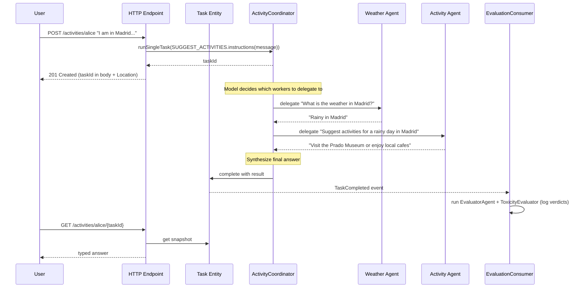

# Multi-Agent System

A sample application demonstrating how to build a multi-agent system using Akka and an AI model. An Autonomous Agent coordinator delegates dynamically to specialized worker agents, with the model deciding which workers to consult for each request.

## Overview

This project illustrates a multi-agent system built around the Autonomous Agent component. The system:

- Receives an activity-suggestion request for a user
- Personalizes the request with any stored user preferences
- Hands the request to an Autonomous Agent coordinator that delegates dynamically to a weather agent and an activity agent
- Returns a typed answer once the coordinator's task completes
- Evaluates each completed task with a custom LLM-as-judge and the built-in toxicity evaluator; verdicts are logged and surfaced through metrics and traces

### Akka components

This sample leverages specific Akka components:

- **Autonomous Agent (`ActivityCoordinator`)**: Accepts a `SuggestActivities` task and declares `Delegation` to the worker agents. The runtime drives its decision loop until the task completes.
- **Agent (`WeatherAgent`, `ActivityAgent`)**: Plain request-based agents that the coordinator delegates to. Each exposes a `query` method whose parameter type is serialized into a tool schema for the coordinator's model. `WeatherAgent.query` takes a `String`; `ActivityAgent.query` takes an `AgentRequest` record so it can look up the user's preferences with the userId.
- **Agent (`EvaluatorAgent`)**: An LLM-as-judge agent that evaluates the coordinator's answer against the original (preference-aware) request.
- **EventSourced Entity (`PreferencesEntity`)**: Holds the user's preferences.
- **Consumer (`EvaluationConsumer`)**: Subscribes to the runtime's task entity events. On task completion it runs `EvaluatorAgent` and the built-in `ToxicityEvaluator`, logging the verdicts.
- **HTTP Endpoint (`ActivityEndpoint`)**: Exposes the `/activities` and `/preferences` routes.

### Other

- **AI model**: The coordinator uses an AI model to choose which workers to consult, what to ask them, and how to synthesize the final answer. The evaluator uses a model to judge each answer.

## Example flow



The set of workers the coordinator consults depends on the user's query and the worker descriptions. Different requests will lead the model to consult only one worker, both, or even loop back for follow-ups.

## Running the application

### Prerequisites
- Java 21 or higher
- Maven 3.6 or higher
- A [Secure Repository Token](https://account.akka.io/token)

### Build and run

---

### Secure Repository Token

Building requires a secure repository token, which is set up as part of [Akka CLI](https://doc.akka.io/getting-started/quick-install-cli.html)'s `akka code init` command.

If you still need to configure your system with the token there are two additional ways:

1. Use the Akka CLI's `akka code token` command and follow the instructions.
2. Set up the token manually as described [here](https://account.akka.io/token).

---

To run the application, you need to provide the following environment variables:
- `OPENAI_API_KEY`: Your OpenAI API key. If you prefer to use a different LLM model, follow the instructions in `application.conf` to change it.
- `WEATHER_API_KEY`: (Optional) API key for the weather service

Set the environment variables:

- On Linux or macOS:

  ```shell
  export OPENAI_API_KEY=your-openai-api-key
  export WEATHER_API_KEY=your-weather-api-key
  ```

- On Windows (command prompt):

  ```shell
  set OPENAI_API_KEY=your-openai-api-key
  set WEATHER_API_KEY=your-weather-api-key
  ```

Build and run the application:
```shell
# Run the application
mvn compile exec:java
```

### Testing the agents

With the application running, you can test the system using the following endpoints:

* Start a new task:
```shell
curl -i -XPOST --location "http://localhost:9000/activities/alice" \
  --header "Content-Type: application/json" \
  --data '{"message": "I do not work tomorrow. I am in Madrid. What should I do? Beware of the weather"}'
```

The endpoint personalizes the request with any stored preferences and calls `runSingleTask` on the coordinator. The response body and `Location` header carry the task id.

* Retrieve the response for a specific task:
```shell
curl -i -XGET --location "http://localhost:9000/activities/alice/{taskId}"
```

Preferences can be added with:

```shell
curl -i localhost:9000/preferences/alice \
  --header "Content-Type: application/json" \
  -XPOST \
  --data '{
    "preference": "I like outdoor activities."
  }'
```

Preferences are read by the endpoint on each new request and inlined into the task instructions, so subsequent suggestions take them into account. The `EvaluationConsumer` runs on every completed task; inspect the service logs to see its verdicts.

## Deployment

You can use the [Akka Console](https://console.akka.io) to create a project and deploy this service.

Build container image:
```shell
mvn clean install -DskipTests
```
Install the `akka` CLI as documented in [Install Akka CLI](https://doc.akka.io/operations/cli/installation.html).

Set up secret containing OpenAI API key:
```shell
akka secret create generic agent-secrets \
  --literal openai-key=$OPENAI_API_KEY \
  --literal weather-key=$WEATHER_API_KEY
```

Deploy the service using the image tag from above `mvn install` and the secrets:
```shell
akka service deploy multi-agent multi-agent:<tag-name> --push \
  --secret-env OPENAI_API_KEY=agent-secrets/openai-key \
  --secret-env WEATHER_API_KEY=agent-secrets/weather-key
```

Refer to [Deploy and manage services](https://doc.akka.io/operations/services/deploy-service.html)
for more information.

To understand the Akka concepts that are the basis for this example, see [Development Process](https://doc.akka.io/concepts/development-process.html) in the documentation.
